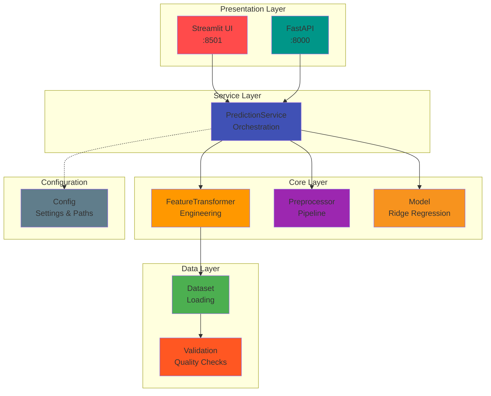
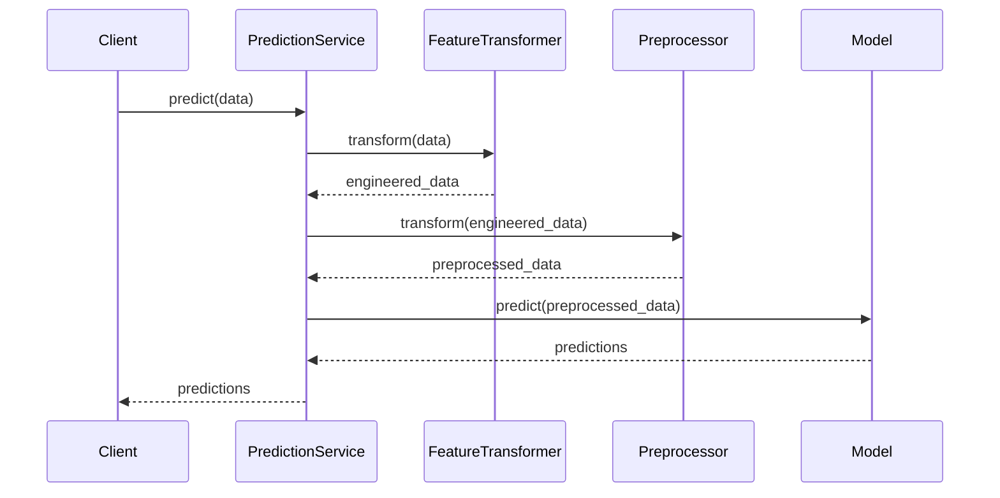
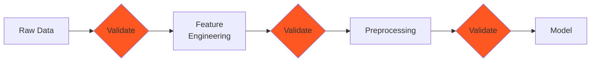
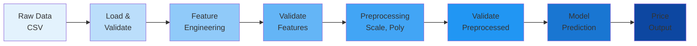
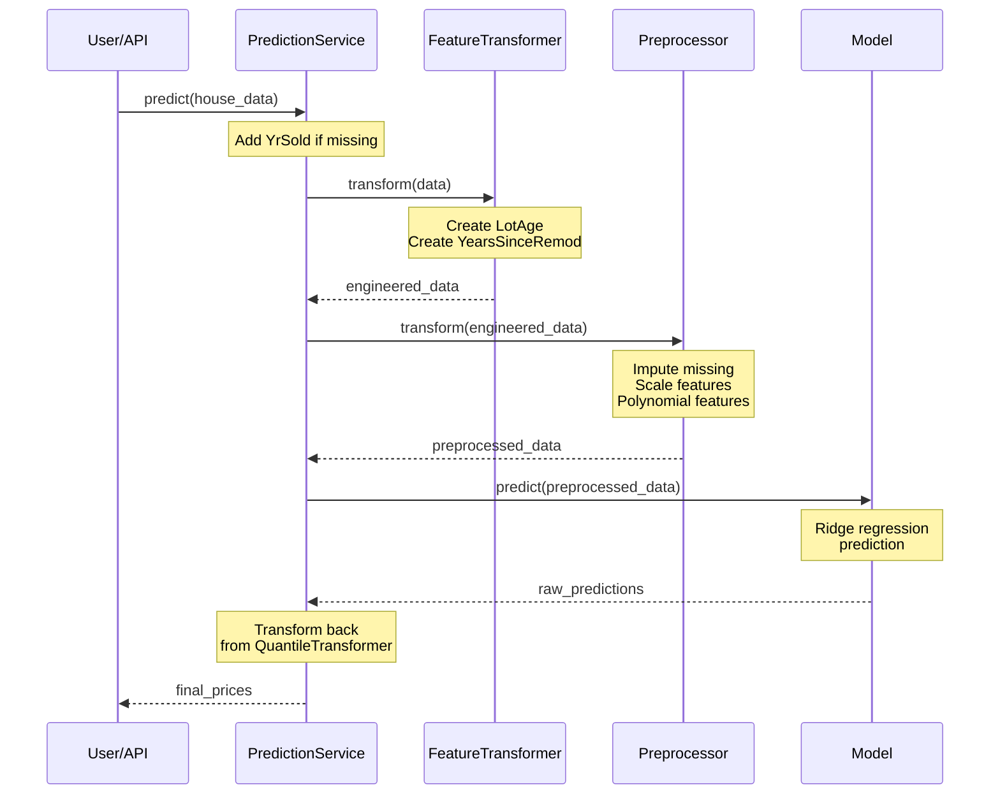

# 🏗️ System Architecture

This page explains the architectural design and principles behind the AMES House Price Prediction system.

## 🎯 Overview

The system implements a **modular, layered architecture** with clear separation of concerns, making it maintainable, testable, and extensible.

### Architectural Layers



## 📦 Project Structure

### Directory Organization

```
house-price-quoting-app/
├── ames_house_price_prediction/    # Core ML library
│   ├── config/                     # Configuration (paths, features, settings)
│   ├── core/                       # Core abstractions & implementations
│   ├── data/                       # Data preparation
│   ├── features/                   # Feature engineering
│   ├── modeling/                   # Training & inference
│   ├── validation/                 # Data validation
│   ├── utils/                      # Utilities (logging)
│   └── engine.py                   # Pipeline orchestration
├── api/                            # FastAPI service
├── app/                            # Streamlit frontend
├── data/                           # Data artifacts
├── models/                         # Trained models
├── tests/                          # Test suite
└── docs/                           # Documentation
```

[View complete structure →](../index.md#project-structure)

## 🧩 Core Components

### 1. Configuration Layer

Separated configuration into logical modules for clarity:

| Module | Purpose | Example |
|--------|---------|---------|
| `paths.py` | File and directory paths | `MODELS_DIR`, `RAW_DATA_DIR` |
| `features.py` | Feature definitions | `NUMERICAL_FEATURES`, `TARGET` |
| `models.py` | Model hyperparameters | `RIDGE_ALPHA`, `POLY_DEGREE` |
| `settings.py` | App settings | `LOG_LEVEL`, environment vars |

**Benefits:**

- ✅ Single source of truth for configuration

- ✅ Easy to modify without touching unrelated settings

- ✅ Environment-specific configs

- ✅ Type-safe with Python modules

**Example:**
```python
from ames_house_price_prediction.config.paths import MODELS_DIR
from ames_house_price_prediction.config.features import NUMERICAL_FEATURES
from ames_house_price_prediction.config.models import RIDGE_ALPHA
```

### 2. Core Abstractions

#### Abstract Interfaces

We define abstract base classes for key components:

```python
from abc import ABC, abstractmethod

class Model(ABC):
    """Abstract base class for ML models."""
    
    @abstractmethod
    def fit(self, X, y):
        """Train the model."""
        pass
    
    @abstractmethod
    def predict(self, X):
        """Make predictions."""
        pass
    
    @abstractmethod
    def save(self, path):
        """Save model to disk."""
        pass
    
    @classmethod
    @abstractmethod
    def load(cls, path):
        """Load model from disk."""
        pass
```

**Interfaces defined:**
- `FeatureTransformer` - Feature engineering
- `Preprocessor` - Data preprocessing
- `Model` - ML models

**Benefits:**
- ✅ Enables dependency injection
- ✅ Easy to mock for testing
- ✅ Swap implementations without code changes
- ✅ Enforces consistent APIs

#### Implementations

| Interface | Implementation | File |
|-----------|----------------|------|
| `FeatureTransformer` | `HouseFeaturesTransformer` | `core/feature_transformer.py` |
| `Preprocessor` | `HousingDataPreprocessor` | `core/preprocessing.py` |
| `Model` | `HousingPriceModel` | `core/model.py` |

### 3. Prediction Service

The **PredictionService** orchestrates the complete pipeline:



**Key Features:**
- Single entry point for predictions
- Manages component lifecycle
- Can load from saved artifacts
- Can be initialized with custom components

**Usage:**
```python
# Load from saved models
service = PredictionService.from_files()

# Single prediction
price = service.predict_single(
    LotArea=8450,
    YearBuilt=2003,
    YearRemodAdd=2003,
    YrSold=2024,
    OverallQual=7,
    OverallCond=5
)

# Batch predictions
prices = service.predict(dataframe)
```

[View code API →](../reference/code-api/core.md)

### 4. API Layer

FastAPI service providing REST endpoints:

**Features:**
- ✅ Pydantic models for validation
- ✅ Automatic OpenAPI/Swagger docs
- ✅ GET and POST endpoints
- ✅ Error handling with proper HTTP codes
- ✅ Health check endpoint

**Architecture:**
```python
@app.get("/quote/")
def get_quote(
    LotArea: float,
    YearBuilt: int,
    # ... other params
) -> QuoteResponse:
    # 1. Validate inputs (Pydantic)
    # 2. Call PredictionService
    # 3. Return structured response
    pass
```

[View API reference →](../reference/api-endpoints.md)

### 5. Data Validation Layer

Great Expectations integration for data quality:

**Validation Points:**


1. **Raw data** - Schema, types, ranges
2. **Engineered features** - Derived feature validation
3. **Preprocessed data** - Final checks before model

[Learn more about validation →](validation-strategy.md)

## 🎨 Design Principles

### 1. Separation of Concerns

Each module has a **single, well-defined responsibility**:

- Configuration → Only configuration
- Feature engineering → Only feature transformation
- Preprocessing → Only data preparation
- Model → Only predictions

### 2. Dependency Injection

Components receive dependencies rather than creating them:

```python
# ❌ Bad: Creates own dependencies
class Service:
    def __init__(self):
        self.model = Model()  # Hard-coded dependency
        
# ✅ Good: Receives dependencies
class Service:
    def __init__(self, model: Model):
        self.model = model  # Injected dependency
```

**Benefits:**
- Easy to test with mocks
- Easy to swap implementations
- Loose coupling

### 3. Interface-Based Design

Program to interfaces, not implementations:

```python
# Function accepts any Model implementation
def evaluate(model: Model, data: pd.DataFrame) -> float:
    predictions = model.predict(data)
    return calculate_metrics(predictions)
```

### 4. DRY (Don't Repeat Yourself)

Shared logic is centralized:

- Feature engineering logic → `FeatureTransformer`
- Preprocessing logic → `Preprocessor`
- Prediction logic → `PredictionService`

### 5. Fail Fast

Validate early and provide clear errors:

```python
# Validate at API boundary
class HouseFeatures(BaseModel):
    LotArea: float = Field(gt=0, description="Lot area in sq ft")
    YearBuilt: int = Field(ge=1800, le=2100)
    # ... Pydantic validates immediately
```

## 🔄 Data Flow

### Complete Pipeline



### Prediction Flow



## 🧪 Testability

The architecture enables comprehensive testing:

### Unit Tests

Mock dependencies for fast, isolated tests:

```python
class MockModel(Model):
    def predict(self, X):
        return np.array([100000.0] * len(X))

def test_service():
    service = PredictionService(
        feature_transformer=MockFeatureTransformer(),
        preprocessor=MockPreprocessor(),
        model=MockModel()
    )
    
    result = service.predict_single(...)
    assert result == 100000.0
```

### Integration Tests

Test component interactions:

```python
def test_complete_pipeline():
    service = PredictionService.from_files()
    result = service.predict(test_data)
    assert len(result) == len(test_data)
    assert all(result > 0)  # Prices should be positive
```

### E2E Tests

Test the complete workflow:

```python
def test_api_endpoint():
    response = client.get("/quote/?LotArea=8450&...")
    assert response.status_code == 200
    assert "predicted_price" in response.json()
```

[Learn more about testing →](testing-strategy.md)

## 🔧 Extensibility

Easy to extend with new features:

### Add a New Model Type

```python
class XGBoostModel(Model):
    """XGBoost implementation."""
    
    def fit(self, X, y):
        self.model = XGBRegressor()
        self.model.fit(X, y)
    
    def predict(self, X):
        return self.model.predict(X)
    
    # ... save/load methods
```

Use it:
```python
service = PredictionService(
    feature_transformer=HouseFeaturesTransformer(),
    preprocessor=HousingDataPreprocessor(),
    model=XGBoostModel()  # ← New model!
)
```

### Add New Features

```python
class EnhancedFeatureTransformer(FeatureTransformer):
    """Extended feature engineering."""
    
    def transform(self, data: pd.DataFrame) -> pd.DataFrame:
        data = super().transform(data)  # Base features
        
        # Add custom features
        data['PricePerSqFt'] = data['SalePrice'] / data['LotArea']
        data['QualityAge'] = data['OverallQual'] * data['LotAge']
        
        return data
```

### A/B Testing

Test different configurations:

```python
service_a = PredictionService(..., model=ModelA())
service_b = PredictionService(..., model=ModelB())

predictions_a = service_a.predict(test_data)
predictions_b = service_b.predict(test_data)

# Compare performance
```

## 📊 Performance Considerations

### Caching

Models and preprocessors are loaded once:

```python
# Load once, use many times
service = PredictionService.from_files()

for batch in data_batches:
    predictions = service.predict(batch)
```

### Batch Processing

Vectorized operations for efficiency:

```python
# Efficient: Processes entire DataFrame at once
predictions = service.predict(df)  # Fast

# Inefficient: Row-by-row processing
for _, row in df.iterrows():
    pred = service.predict_single(...)  # Slow
```

### Memory Management

Components can be reloaded:

```python
# Reload if model updated
service.model = HousingPriceModel.load(new_model_path)
```

## 🎯 Key Improvements

Compared to monolithic design:

| Aspect | Before | After |
|--------|--------|-------|
| **Config** | Single file | Modular by concern |
| **Reusability** | Copy-paste code | Import components |
| **Testing** | Hard to mock | Easy with interfaces |
| **Flexibility** | Rigid | Swap implementations |
| **Maintenance** | Scattered logic | Centralized |
| **Documentation** | Implicit | Explicit interfaces |

## 🚀 Future Enhancements

Potential architectural improvements:

1. **Model Registry** - Track multiple model versions
2. **Feature Store** - Centralized feature definitions
3. **A/B Testing Framework** - Compare models systematically
4. **Async Processing** - Handle concurrent requests
5. **Monitoring** - Performance tracking and drift detection
6. **Caching Layer** - Redis for prediction caching
7. **Event Sourcing** - Track all predictions for audit

## 📚 Related Documentation

- [ML Pipeline →](ml-pipeline.md) - How data flows through the system
- [Testing Strategy →](testing-strategy.md) - How we ensure quality
- [API Reference →](../reference/api-endpoints.md) - API specifications
- [Code API →](../reference/code-api/core.md) - Component documentation

---

!!! tip "Understanding Architecture"
    This architecture enables the system to be:
    
    - **Testable** - Easy to write unit, integration, and E2E tests
    - **Maintainable** - Clear structure, single responsibility
    - **Extensible** - Add new features without breaking existing code
    - **Flexible** - Swap components easily
    - **Production-ready** - Proper error handling, validation, monitoring
