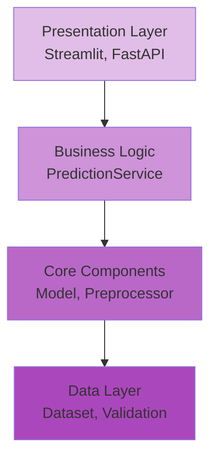

# 💡 Explanation

Understanding-oriented discussions about the design, architecture, and key concepts of the AMES House Price Prediction system.

## 🎯 About Explanations

Explanations clarify and illuminate **why** things are designed the way they are. They provide context, background, and deeper understanding of the system's concepts and decisions.

## 📚 Available Topics

-   :material-sitemap:{ .lg .middle } __[Architecture](architecture.md)__

    ---

    System design, component interactions, and architectural patterns

    [:octicons-arrow-right-24: Read more](architecture.md)

-   :material-pipeline:{ .lg .middle } __[ML Pipeline](ml-pipeline.md)__

    ---

    How data flows from raw input to predictions

    [:octicons-arrow-right-24: Read more](ml-pipeline.md)

-   :material-shield-check:{ .lg .middle } __[Validation Strategy](validation-strategy.md)__

    ---

    Why data validation matters and how it's implemented

    [:octicons-arrow-right-24: Read more](validation-strategy.md)

-   :material-package-variant-closed:{ .lg .middle } __[Dependency Management](dependency-management.md)__

    ---

    Why we use uv instead of pip and what benefits it provides

    [:octicons-arrow-right-24: Read more](dependency-management.md)

-   :material-test-tube:{ .lg .middle } __[Testing Strategy](testing-strategy.md)__

    ---

    Testing philosophy, coverage goals, and test organization

    [:octicons-arrow-right-24: Read more](testing-strategy.md)

-   :material-puzzle:{ .lg .middle } __[Feature Engineering](feature-engineering.md)__

    ---

    Rationale behind feature selection and transformation

    [:octicons-arrow-right-24: Read more](feature-engineering.md)

## 🤔 Key Questions Answered

### Architecture & Design

??? question "Why is the code organized this way?"
    The project follows a layered architecture with clear separation of concerns. [Learn more →](architecture.md#design-principles)

??? question "Why use dependency injection?"
    Dependency injection makes the code testable, flexible, and follows SOLID principles. [Learn more →](architecture.md#dependency-injection)

??? question "Why abstract interfaces?"
    Interfaces allow us to swap implementations without changing dependent code. [Learn more →](architecture.md#interfaces)

### ML Pipeline

??? question "Why Ridge regression instead of other algorithms?"
    Ridge regression provides good performance with regularization to prevent overfitting. [Learn more →](ml-pipeline.md#model-selection)

??? question "Why polynomial features?"
    Polynomial features capture non-linear relationships between features. [Learn more →](ml-pipeline.md#feature-transformation)

??? question "Why this specific preprocessing pipeline?"
    The pipeline handles missing data, outliers, and scales features appropriately. [Learn more →](ml-pipeline.md#preprocessing)

### Data Validation

??? question "Why validate data at multiple stages?"
    Validation at each stage catches errors early and maintains data quality. [Learn more →](validation-strategy.md#multi-stage-validation)

??? question "Why Great Expectations?"
    Great Expectations provides declarative validation with excellent reporting. [Learn more →](validation-strategy.md#tool-selection)

### Development Practices

??? question "Why uv instead of pip?"
    uv is 10-100x faster and provides deterministic dependency resolution. [Learn more →](dependency-management.md#why-uv)

??? question "Why 83% test coverage?"
    We focus on high-value tests rather than 100% coverage for its own sake. [Learn more →](testing-strategy.md#coverage-goals)

??? question "Why separate unit, integration, and E2E tests?"
    Different test types serve different purposes and run at different speeds. [Learn more →](testing-strategy.md#test-organization)

## 💭 Understanding vs Doing

!!! info "Explanation vs How-To"
    
    **Explanations** answer "why?" and "what does this mean?"
    
    - Why did we choose this architecture?
    - What are the trade-offs?
    - How do concepts relate?
    
    **[How-To Guides](../how-to/)** answer "how do I?"
    
    - How do I add a feature?
    - How do I run tests?
    - How do I deploy?

## 🌟 Key Concepts

### Clean Architecture

The system follows clean architecture principles with clear boundaries between layers:

[Learn more about the architecture →](architecture.md)

### The ML Pipeline

Data flows through a series of transformations:

**Raw Data → Validation → Feature Engineering → Preprocessing → Model → Prediction**

Each stage has a specific responsibility and can be tested independently. [Learn more →](ml-pipeline.md)

### Data Quality

Data validation happens at three key points:

1. **Raw data ingestion** - Ensure source data meets expectations
2. **After feature engineering** - Validate derived features
3. **At API boundaries** - Validate user inputs

[Learn more about validation →](validation-strategy.md)

## 📖 Related Documentation

Looking for something more practical?

- **[Tutorials](../tutorials/)** - Learn through hands-on examples
- **[How-To Guides](../how-to/)** - Solve specific problems
- **[Reference](../reference/)** - Look up technical details

---

  
Ready to understand the system deeply?

  

    <a href="architecture/">Start with Architecture</a> •
    <a href="ml-pipeline/">Explore the ML Pipeline</a> •
    <a href="validation-strategy/">Learn about Validation</a>
  

