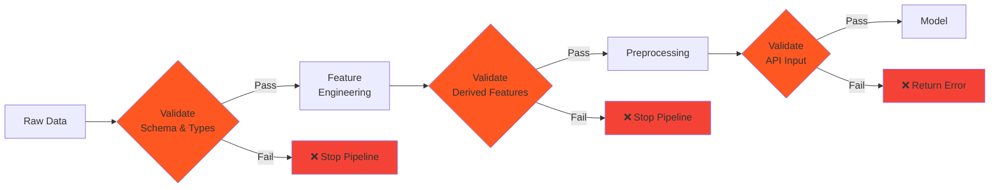

# 🛡️ Data Validation Strategy

Why data validation matters and how it's implemented in the AMES House Price Prediction system.

## 🎯 Why Validate Data?

### The Problem

Without validation:
- ❌ Bad data reaches the model silently
- ❌ Model makes unreliable predictions
- ❌ Debugging is difficult
- ❌ Production failures are mysterious
- ❌ Data drift goes unnoticed

### The Solution

With validation:
- ✅ Catch errors early
- ✅ Provide clear error messages
- ✅ Document data expectations formally
- ✅ Monitor data quality over time
- ✅ Build confidence in predictions

## 🏗️ Multi-Layer Validation

We validate at three strategic points:



### 1. Raw Data Validation (Great Expectations)

**When:** After loading from CSV  
**Purpose:** Ensure source data meets expectations  
**Action on failure:** Stop pipeline

**Checks:**
- Required columns exist
- Data types are correct (int64, float64)
- Values are in valid ranges
- No unexpected nulls
- Cross-field rules (e.g., YrSold ≥ YearBuilt)

```python
from ames_house_price_prediction.validation import validate_raw_data

result = validate_raw_data(df, include_target=True)
if not result.success:
    raise ValueError(f"Validation failed: {result.get_failure_summary()}")
```

### 2. Engineered Features Validation (Great Expectations)

**When:** After feature engineering  
**Purpose:** Validate derived features are correct  
**Action on failure:** Stop pipeline

**Checks:**
- New columns created (LotAge, YearsSinceRemod)
- Calculations are correct
- Values are non-negative where expected
- Business rules hold

```python
from ames_house_price_prediction.validation import validate_engineered_features

result = validate_engineered_features(df)
if not result.success:
    raise ValueError("Feature engineering produced invalid data")
```

### 3. API Input Validation (Pydantic)

**When:** API request received  
**Purpose:** Validate user inputs immediately  
**Action on failure:** Return HTTP 422 with details

**Checks:**
- All required fields present
- Types are correct
- Values in valid ranges
- Cross-field rules

```python
from pydantic import BaseModel, Field

class HouseFeatures(BaseModel):
    LotArea: float = Field(gt=0, description="Lot area in square feet")
    YearBuilt: int = Field(ge=1800, le=2100)
    OverallQual: int = Field(ge=1, le=10)
    # ... Pydantic validates automatically
```

## 🔍 Why Great Expectations?

### Declarative Validation

Define expectations in a clear, readable way:

```python
suite.add_expectation(
    ExpectationConfiguration(
        expectation_type="expect_column_values_to_be_between",
        kwargs={
            "column": "OverallQual",
            "min_value": 1,
            "max_value": 10,
        }
    )
)
```

### Rich Reporting

Get detailed results:

```python
result = validate_raw_data(df)
print(result.statistics)
# {
#     'evaluated_expectations': 23,
#     'successful_expectations': 23,
#     'unsuccessful_expectations': 0,
#     'success_percent': 100.0
# }
```

### Flexible Tolerance

Allow for data quality issues:

```python
# Allow 1% of rows to violate the rule
suite.add_expectation(
    ExpectationConfiguration(
        expectation_type="expect_column_pair_values_a_to_be_greater_than_b",
        kwargs={
            "column_A": "YrSold",
            "column_B": "YearBuilt",
            "mostly": 0.99  # 99% must pass
        }
    )
)
```

## 📊 Validation Suites

### Raw Data Suite (23 expectations)

1. **Schema Validation**
   - Required columns exist
   - Columns have correct types

2. **Range Validation**
   - LotArea: 1,300 - 215,245 sq ft
   - YearBuilt: 1872 - 2010
   - OverallQual/Cond: 1 - 10

3. **Cross-Field Validation**
   - YrSold ≥ YearBuilt
   - YrSold ≥ YearRemodAdd
   - YearRemodAdd ≥ YearBuilt

### Engineered Features Suite (5 expectations)

1. **New Columns Exist**
   - LotAge
   - YearsSinceRemod

2. **Calculation Correctness**
   - LotAge = YrSold - YearBuilt
   - Values are non-negative

### Preprocessed Data Suite (3 expectations)

1. **Data Quality**
   - No NaN values
   - No infinite values
   - Minimum row count met

## 🎭 Two Validation Systems

### Why Both Pydantic and Great Expectations?

They serve different purposes:

| Aspect | Pydantic | Great Expectations |
|--------|----------|-------------------|
| **Use Case** | API input validation | Batch data validation |
| **Speed** | < 1ms | ~100ms |
| **Focus** | Individual records | Entire datasets |
| **Errors** | User-friendly | Statistical reports |
| **When** | Real-time | Batch/Training |
| **Blocking** | Yes (return 422) | Yes (stop pipeline) |

### Pydantic for APIs

**Strengths:**
- ✅ Lightning fast
- ✅ User-friendly error messages
- ✅ Automatic OpenAPI docs
- ✅ Type conversion
- ✅ Perfect for real-time

**Example Error:**
```json
{
  "detail": [
    {
      "loc": ["query", "OverallQual"],
      "msg": "ensure this value is greater than or equal to 1",
      "type": "value_error.number.not_ge"
    }
  ]
}
```

### Great Expectations for Pipelines

**Strengths:**
- ✅ Comprehensive checks
- ✅ Statistical validation
- ✅ Rich reporting
- ✅ Data profiling
- ✅ Perfect for batch processing

**Example Output:**
```
✓ Raw data validation passed!
  23/23 expectations passed
  
  Successful expectations:
  - Column 'LotArea' exists
  - Column 'LotArea' values are between 1300 and 215245
  - Column 'YrSold' values are >= Column 'YearBuilt'
  ...
```

## 🔄 Validation in the Pipeline

### Training Pipeline

```python
# Step 1: Load raw data
df = pd.read_csv("data/raw/train.csv")

# Step 2: Validate raw data
result = validate_raw_data(df, include_target=True)
if not result.success:
    raise ValueError(f"Validation failed: {result}")

# Step 3: Engineer features
df = transformer.transform(df)

# Step 4: Validate engineered features
result = validate_engineered_features(df)
if not result.success:
    raise ValueError(f"Feature validation failed: {result}")

# Step 5: Preprocess
X_processed = preprocessor.fit_transform(X, y)

# Step 6: Validate preprocessed (optional)
result = validate_test_data(X_processed)
# Continue even if this fails (just log it)
```

### API Pipeline

```python
@app.get("/quote/")
def get_quote(
    # Pydantic validates automatically
    LotArea: float = Query(gt=0),
    YearBuilt: int = Query(ge=1800, le=2100),
    OverallQual: int = Query(ge=1, le=10),
    # ...
) -> QuoteResponse:
    # If we get here, input is valid!
    prediction = service.predict_single(...)
    return QuoteResponse(predicted_price=prediction)
```

## 🎯 Design Decisions

### 1. Fail Fast in Training

Stop immediately when training data is invalid:

```python
result = validate_raw_data(df)
if not result.success:
    raise ValidationError(result.get_failure_summary())
```

**Why?**
- Don't waste time training on bad data
- Catch issues early when fixing is cheap
- Prevent garbage-in-garbage-out

### 2. Non-Blocking in API

Never fail API requests due to GE validation:

```python
try:
    result = validate_api_input(data)
    if not result.success:
        logger.warning(f"Validation warning: {result}")
except Exception as e:
    logger.error(f"Validation error: {e}")
finally:
    # Always continue with prediction
    return prediction
```

**Why?**
- Don't impact user experience
- Pydantic already validated
- Use GE for monitoring only

### 3. Tolerant Validation

Allow small percentages of rule violations:

```python
suite.add_expectation(
    ...,
    "mostly": 0.99  # 99% must pass, 1% can fail
)
```

**Why?**
- Real-world data has quality issues
- Some rows may have data entry errors
- Don't block entire pipeline for 1 bad row

## 📈 Benefits Realized

### Before Validation

```python
# Silent failures
df = pd.read_csv("train.csv")
model.fit(df)  # What if df is corrupted?
# Model trains but performs poorly
```

### After Validation

```python
# Explicit validation
df = pd.read_csv("train.csv")
result = validate_raw_data(df)

if not result.success:
    print(f"❌ Data validation failed!")
    print(result.get_failure_summary())
    # Clear error message, easy to debug
    sys.exit(1)

# Only train on validated data
model.fit(df)
```

## 🔧 Custom Expectations

You can add project-specific validations:

```python
class CustomExpectations:
    @staticmethod
    def expect_reasonable_price(df: pd.DataFrame, column: str = "SalePrice"):
        """Expect house prices to be reasonable."""
        values = df[column]
        
        # Check if prices are in reasonable range
        min_price = 30_000  # $30k minimum
        max_price = 800_000  # $800k maximum
        
        valid = (values >= min_price) & (values <= max_price)
        percent_valid = valid.mean() * 100
        
        return {
            "success": percent_valid >= 95,  # 95% must be in range
            "result": {
                "percent_valid": percent_valid,
                "out_of_range_count": (~valid).sum()
            }
        }
```

## 📚 Related Documentation

- [How to validate data →](../how-to/validate-data.md) - Practical guide
- [Architecture →](architecture.md) - Where validation fits
- [Data schema →](../reference/data-schema.md) - What we validate

---

!!! success "Key Takeaways"
    
    **Multi-layer validation** catches errors at the right place:
    
    - **Great Expectations** for training pipelines (comprehensive)
    - **Pydantic** for API inputs (fast and user-friendly)
    - **Different actions** based on context (fail vs. log)
    
    This strategy ensures data quality without sacrificing performance or user experience.
