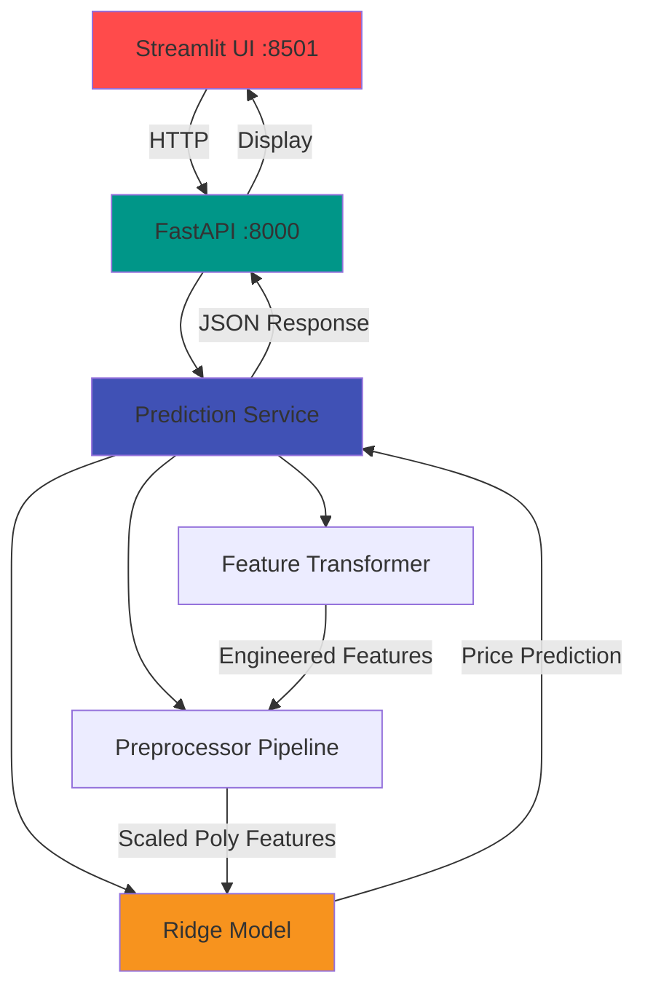

# 🏠 AMES House Price Prediction

<div class="grid cards" markdown>

-   :material-clock-fast:{ .lg .middle } __Quick & Accurate__

    ---

    Get house price predictions in milliseconds using a production-ready Ridge regression model with 83% test coverage

-   :material-api:{ .lg .middle } __RESTful API__

    ---

    FastAPI-powered service with automatic OpenAPI documentation and input validation

-   :material-web:{ .lg .middle } __Interactive UI__

    ---

    Beautiful Streamlit interface for easy predictions without writing code

-   :material-docker:{ .lg .middle } __Docker Ready__

    ---

    One-command deployment with Docker Compose for instant setup

</div>

## Overview

A production-ready machine learning system for predicting house prices using the AMES Housing dataset. Built with modern Python tools and best practices, featuring comprehensive data validation, extensive testing, and clean architecture.

<div align="center" markdown>


</div>

## ✨ Key Features

### 🎯 Accurate Predictions
Ridge regression with polynomial features achieves robust price predictions through engineered features and validated data pipelines.

### 🔌 Production-Ready API
FastAPI service with:

- Automatic OpenAPI/Swagger documentation
- Request/response validation with Pydantic
- Comprehensive error handling
- Health check endpoints

### 🖥️ User-Friendly Interface
Streamlit web app featuring:

- Interactive input forms
- Real-time predictions
- Clean, modern UI
- No coding required

### 🏗️ Clean Architecture
Modular design with:

- Dependency injection
- Abstract interfaces
- Separation of concerns
- Easy testing and extension

### ✅ Data Validation
Great Expectations integration:

- Schema validation
- Range checking
- Cross-field validation
- Business rule enforcement

### 🧪 Thoroughly Tested
Comprehensive test suite:

- 136 tests across unit, integration, and E2E
- 83% code coverage
- Mocked and real-world scenarios
- CI/CD ready

## 🚀 Quick Start

=== "Docker (Recommended)"

    ```bash
    # Clone and run in 30 seconds
    git clone <repository-url>
    cd house-price-quoting-app
    docker-compose up --build
    ```

    Access the services:

    - **Streamlit UI**: [http://localhost:8501](http://localhost:8501)
    - **FastAPI**: [http://localhost:8000](http://localhost:8000)
    - **API Docs**: [http://localhost:8000/docs](http://localhost:8000/docs)

=== "Local Development"

    ```bash
    # Install uv package manager
    curl -LsSf https://astral.sh/uv/install.sh | sh

    # Clone repository
    git clone <repository-url>
    cd house-price-quoting-app

    # Create environment and install dependencies
    python -m venv .venv
    source .venv/bin/activate
    uv pip sync requirements-dev.lock

    # Run tests
    uv run pytest

    # Start services
    cd api && uvicorn main:app --reload &
    cd app && streamlit run main.py
    ```

=== "API Usage"

    ```python
    import requests

    # Make a prediction
    response = requests.get(
        "http://localhost:8000/quote/",
        params={
            "LotArea": 8450,
            "YearBuilt": 2003,
            "YearRemodAdd": 2003,
            "OverallQual": 7,
            "OverallCond": 5,
        }
    )

    result = response.json()
    print(f"Predicted price: ${result['predicted_price']:,.2f}")
    ```

## 📖 Documentation Structure

This documentation follows the [Diátaxis framework](https://diataxis.fr/) for systematic documentation:

<div class="grid cards" markdown>

-   :material-school:{ .lg .middle } __[Tutorials](tutorials/)__

    ---

    Learning-oriented lessons to get you started quickly. Perfect for beginners who want hands-on experience.

    [:octicons-arrow-right-24: Get started](tutorials/)

-   :material-hammer-wrench:{ .lg .middle } __[How-To Guides](how-to/)__

    ---

    Problem-oriented recipes for common tasks. Practical guides for specific goals.

    [:octicons-arrow-right-24: Solve problems](how-to/)

-   :material-book-open-variant:{ .lg .middle } __[Reference](reference/)__

    ---

    Information-oriented technical descriptions. Complete API documentation and specifications.

    [:octicons-arrow-right-24: Look up details](reference/)

-   :material-lightbulb-on:{ .lg .middle } __[Explanation](explanation/)__

    ---

    Understanding-oriented discussions. Learn why things work the way they do.

    [:octicons-arrow-right-24: Deepen understanding](explanation/)

</div>

## 🏗️ Architecture



### Key Components

- **Feature Transformer**: Creates derived features (LotAge, YearsSinceRemod)
- **Preprocessor**: Handles missing values, scaling, polynomial features
- **Model**: Ridge regression with optimal hyperparameters
- **Validation**: Great Expectations for data quality checks

[Learn more about the architecture →](explanation/architecture.md)

## 🛠️ Technology Stack

<div align="center" markdown>


</div>

### Core Stack

- **ML Framework**: scikit-learn, pandas, numpy
- **Web Framework**: FastAPI, Streamlit, Uvicorn
- **Data Validation**: Great Expectations, Pydantic
- **Testing**: pytest, pytest-cov, pytest-asyncio
- **Deployment**: Docker, Docker Compose
- **Package Management**: uv (10-100x faster than pip)

## 📊 Model Performance

| Metric | Value |
|--------|-------|
| **Algorithm** | Ridge Regression |
| **Polynomial Degree** | 2 |
| **Target Transform** | QuantileTransformer |
| **Features** | 5 core + 2 engineered |
| **Test Coverage** | 83% (136 tests) |
| **Validation** | 4 Great Expectations suites |

## 🎯 Use Cases

=== "Home Sellers"

    Get quick, automated price estimates based on your home's characteristics without waiting for professional appraisal.

=== "Real Estate Apps"

    Integrate the API into your real estate application for instant property valuations.

=== "ML Education"

    Learn production ML practices with a complete, well-documented example project.

=== "Data Scientists"

    Use as a template for building production-ready ML services with best practices.

## 🚦 Next Steps

<div class="grid cards" markdown>

-   :material-rocket-launch:{ .lg .middle } __New to the project?__

    ---

    Start with our [Quick Start Tutorial](tutorials/quickstart.md) to make your first prediction in 5 minutes.

-   :material-code-braces:{ .lg .middle } __Want to customize?__

    ---

    Check out [How-To Guides](how-to/) for practical recipes on common tasks.

-   :material-api:{ .lg .middle } __API Integration?__

    ---

    See the complete [API Reference](reference/api-endpoints.md) for all endpoints and parameters.

-   :material-thought-bubble:{ .lg .middle } __Understand the design?__

    ---

    Read [Explanation](explanation/) to learn about architecture and design decisions.

</div>

## 📄 License

This project is open source. See [LICENSE](https://github.com/nikolaos-mavromatis/ames_house_price_prediction/blob/main/LICENSE) for details.

## 🤝 Contributing

Contributions are welcome! Check out our [Contributing Guide](contributing.md) to get started.

---

<div align="center">
  <p>Made with ❤️ using modern ML engineering practices</p>
  <p>
    <a href="https://github.com/nikolaos-mavromatis/ames_house_price_prediction">View on GitHub</a> •
    <a href="tutorials/quickstart/">Get Started</a> •
    <a href="reference/api-endpoints/">API Docs</a>
  </p>
</div>
