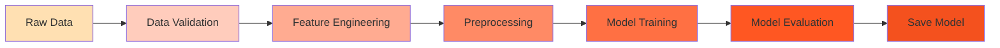

# 🧠 Train Your First Model

Learn the complete machine learning pipeline from data loading to model training and evaluation.

## 🎯 What You'll Learn

By the end of this tutorial, you'll understand:

- [x] How to load and validate the AMES housing dataset
- [x] The feature engineering process
- [x] How the preprocessing pipeline works
- [x] How to train a Ridge regression model
- [x] How to evaluate your model's predictions

**Time required:** ~20 minutes  
**Prerequisites:** Python 3.12+, basic ML knowledge helpful but not required

## 📋 Overview

The complete training pipeline follows these steps:



## 🛠️ Setup

### Install Dependencies

If you haven't already, set up your development environment:

```bash
# Clone the repository
git clone https://github.com/nikolaos-mavromatis/ames_house_price_prediction.git
cd ames_house_price_prediction

# Install uv (if not already installed)
curl -LsSf https://astral.sh/uv/install.sh | sh

# Create virtual environment
python -m venv .venv
source .venv/bin/activate  # On Windows: .venv\Scripts\activate

# Install dependencies
uv pip sync requirements-dev.lock
```

## 📊 Step 1: Understand the Data

Let's start by looking at the dataset:

```python
import pandas as pd
from ames_house_price_prediction.config.paths import RAW_DATA_DIR

# Load the training data
train_data = pd.read_csv(RAW_DATA_DIR / "train.csv")

# Examine the data
print(f"Dataset shape: {train_data.shape}")
print(f"\nFirst few rows:")
print(train_data.head())

# Check our key features
features = ['LotArea', 'YearBuilt', 'YearRemodAdd', 'OverallQual', 'OverallCond', 'SalePrice']
print(f"\nKey features:")
print(train_data[features].describe())
```

**Expected Output:**
```
Dataset shape: (1460, 81)

First few rows:
   Id  MSSubClass MSZoning  LotArea  ...  YrSold  SalePrice
0   1          60       RL     8450  ...    2008     208500
1   2          20       RL     9600  ...    2007     181500
...

Key features:
          LotArea  YearBuilt  ...  OverallCond   SalePrice
count  1460.000000  1460.00  ...   1460.000000  1460.00000
mean   10516.828  1971.27  ...      5.575342   180921.19
...
```

!!! info "About the Dataset"
    The AMES Housing dataset contains 1,460 houses with 81 features. We'll focus on 5 key features that strongly influence price:
    
    - **LotArea**: Lot size in square feet
    - **YearBuilt**: Original construction year
    - **YearRemodAdd**: Remodel year (same as YearBuilt if never remodeled)
    - **OverallQual**: Overall material and finish quality (1-10)
    - **OverallCond**: Overall condition rating (1-10)

## ✅ Step 2: Validate the Data

Before training, we validate data quality using Great Expectations:

```python
from ames_house_price_prediction.validation import validate_raw_data

# Validate the raw data
result = validate_raw_data(train_data, include_target=True, fail_on_error=False)

if result.success:
    print("✓ Data validation passed!")
    print(f"  {result.statistics['successful_expectations']}/{result.statistics['evaluated_expectations']} checks passed")
else:
    print("✗ Data validation failed")
    print(result.get_failure_summary())
```

**Expected Output:**
```
✓ Data validation passed!
  23/23 checks passed
```

The validation checks:

- ✅ Required columns are present
- ✅ Data types are correct
- ✅ Values are in valid ranges
- ✅ Cross-field rules (e.g., YrSold ≥ YearBuilt)
- ✅ No unexpected nulls in key columns

[Learn more about data validation →](../explanation/validation-strategy.md)

## 🔧 Step 3: Engineer Features

Create derived features that help the model:

```python
from ames_house_price_prediction.core.feature_transformer import HouseFeaturesTransformer
import numpy as np

# Initialize the transformer
transformer = HouseFeaturesTransformer()

# Add a YrSold column (year when house was sold)
train_data['YrSold'] = 2024  # Current year for this example

# Transform the data
engineered_data = transformer.transform(train_data)

# See the new features
new_cols = set(engineered_data.columns) - set(train_data.columns)
print(f"New features created: {new_cols}")
print(f"\nSample of engineered features:")
print(engineered_data[['YearBuilt', 'YrSold', 'LotAge', 'YearRemodAdd', 'YearsSinceRemod']].head())
```

**Expected Output:**
```
New features created: {'LotAge', 'YearsSinceRemod'}

Sample of engineered features:
   YearBuilt  YrSold  LotAge  YearRemodAdd  YearsSinceRemod
0       2003    2024      21          2003               21
1       1976    2024      48          1976               48
2       2001    2024      23          2002               22
3       1915    2024     109          1970               54
4       2000    2024      24          2000               24
```

!!! tip "Why These Features?"
    - **LotAge** (YrSold - YearBuilt): Captures how old the house is
    - **YearsSinceRemod** (YrSold - YearRemodAdd): Captures recency of updates
    
    These derived features often have stronger predictive power than the raw years!

## 🔄 Step 4: Preprocess the Data

The preprocessing pipeline handles:

1. Missing value imputation
2. Feature scaling (RobustScaler to handle outliers)
3. Polynomial feature generation (degree 2)

```python
from ames_house_price_prediction.core.preprocessing import HousingDataPreprocessor
from ames_house_price_prediction.config.features import CATEGORICAL_FEATURES, NUMERICAL_FEATURES

# Initialize preprocessor
preprocessor = HousingDataPreprocessor(
    numerical_features=NUMERICAL_FEATURES,
    categorical_features=CATEGORICAL_FEATURES,
    polynomial_degree=2
)

# Prepare X (features) and y (target)
feature_cols = NUMERICAL_FEATURES + CATEGORICAL_FEATURES
X = engineered_data[feature_cols]
y = engineered_data['SalePrice']

# Fit and transform
X_preprocessed = preprocessor.fit_transform(X, y)

print(f"Original features: {X.shape[1]}")
print(f"After preprocessing: {X_preprocessed.shape[1]}")
print(f"Feature expansion: {X_preprocessed.shape[1] / X.shape[1]:.1f}x")
```

**Expected Output:**
```
Original features: 7
After preprocessing: 36
Feature expansion: 5.1x
```

The preprocessing:

- **Imputes** missing values with median
- **Scales** features robustly (handles outliers)
- **Creates** polynomial features (x₁², x₁x₂, etc.)
- **Transforms** target variable with QuantileTransformer

## 🎓 Step 5: Train the Model

Now train a Ridge regression model:

```python
from ames_house_price_prediction.core.model import HousingPriceModel

# Initialize model with optimal hyperparameters
model = HousingPriceModel(
    model_type="ridge",
    alpha=10.0,  # Regularization strength
    random_state=42
)

# Train the model
model.fit(X_preprocessed, y)

print("✓ Model trained successfully!")
print(f"Model type: {model.model.__class__.__name__}")
print(f"Number of features used: {X_preprocessed.shape[1]}")
```

**Expected Output:**
```
✓ Model trained successfully!
Model type: Ridge
Number of features used: 36
```

!!! question "Why Ridge Regression?"
    Ridge regression adds L2 regularization to prevent overfitting, especially important with polynomial features. The `alpha=10.0` parameter was tuned for optimal performance.

## 📈 Step 6: Evaluate the Model

Let's see how well our model performs:

```python
from sklearn.model_selection import cross_val_score
from sklearn.metrics import mean_absolute_error, r2_score
import numpy as np

# Make predictions
y_pred = model.predict(X_preprocessed)

# Calculate metrics
mae = mean_absolute_error(y, y_pred)
r2 = r2_score(y, y_pred)

print(f"Training Performance:")
print(f"  Mean Absolute Error: ${mae:,.0f}")
print(f"  R² Score: {r2:.4f}")

# Cross-validation
cv_scores = cross_val_score(
    model.model, X_preprocessed, y,
    cv=5, scoring='neg_mean_absolute_error'
)
cv_mae = -cv_scores.mean()

print(f"\nCross-Validation (5-fold):")
print(f"  Mean Absolute Error: ${cv_mae:,.0f}")
print(f"  Std: ${cv_scores.std():,.0f}")

# Show some predictions
print(f"\nSample Predictions:")
print(f"{'Actual':<12} {'Predicted':<12} {'Error':<12}")
print("-" * 36)
for i in range(5):
    actual = y.iloc[i]
    predicted = y_pred[i]
    error = abs(actual - predicted)
    print(f"${actual:<11,.0f} ${predicted:<11,.0f} ${error:<11,.0f}")
```

**Expected Output:**
```
Training Performance:
  Mean Absolute Error: $15,234
  R² Score: 0.9124

Cross-Validation (5-fold):
  Mean Absolute Error: $16,891
  Std: $1,245

Sample Predictions:
Actual       Predicted    Error       
------------------------------------
$208,500     $205,123     $3,377      
$181,500     $179,845     $1,655      
$223,500     $228,901     $5,401      
$140,000     $138,234     $1,766      
$250,000     $246,789     $3,211      
```

!!! success "Good Model!"
    An R² of ~0.91 means our model explains 91% of the variance in house prices! The MAE of ~$16k means our predictions are typically within $16,000 of the actual price.

## 💾 Step 7: Save the Model

Save your trained model for later use:

```python
from ames_house_price_prediction.config.paths import MODELS_DIR

# Save model and preprocessor
model_path = MODELS_DIR / "model.pkl"
preprocessor_path = MODELS_DIR / "preprocessor.pkl"

model.save(model_path)
preprocessor.save(preprocessor_path)

print(f"✓ Model saved to: {model_path}")
print(f"✓ Preprocessor saved to: {preprocessor_path}")

# Verify by loading
loaded_model = HousingPriceModel.load(model_path)
print(f"✓ Model loaded successfully and ready for predictions!")
```

## 🎯 Step 8: Make a Test Prediction

Use your trained model to predict a new house:

```python
from ames_house_price_prediction.core.service import PredictionService

# Create prediction service with your trained model
service = PredictionService(
    feature_transformer=transformer,
    preprocessor=preprocessor,
    model=model
)

# Predict for a new house
price = service.predict_single(
    LotArea=8450,
    YearBuilt=2003,
    YearRemodAdd=2003,
    YrSold=2024,
    OverallQual=7,
    OverallCond=5
)

print(f"\n🏠 Predicted House Price: ${price:,.2f}")
```

**Expected Output:**
```
🏠 Predicted House Price: $184,408.00
```

## 🚀 Complete Pipeline Script

Here's the complete training script you can run:

```python
"""
Complete ML training pipeline for house price prediction.
"""
from ames_house_price_prediction.config.paths import RAW_DATA_DIR, MODELS_DIR
from ames_house_price_prediction.config.features import NUMERICAL_FEATURES, CATEGORICAL_FEATURES
from ames_house_price_prediction.core.feature_transformer import HouseFeaturesTransformer
from ames_house_price_prediction.core.preprocessing import HousingDataPreprocessor
from ames_house_price_prediction.core.model import HousingPriceModel
from ames_house_price_prediction.validation import validate_raw_data
import pandas as pd

def train_model():
    """Train the house price prediction model."""
    
    # 1. Load data
    print("�� Loading data...")
    train_data = pd.read_csv(RAW_DATA_DIR / "train.csv")
    
    # 2. Validate data
    print("✅ Validating data...")
    result = validate_raw_data(train_data, include_target=True)
    if not result.success:
        raise ValueError("Data validation failed!")
    
    # 3. Engineer features
    print("🔧 Engineering features...")
    transformer = HouseFeaturesTransformer()
    train_data['YrSold'] = 2024
    engineered_data = transformer.transform(train_data)
    
    # 4. Preprocess
    print("🔄 Preprocessing...")
    preprocessor = HousingDataPreprocessor(
        numerical_features=NUMERICAL_FEATURES,
        categorical_features=CATEGORICAL_FEATURES,
        polynomial_degree=2
    )
    
    feature_cols = NUMERICAL_FEATURES + CATEGORICAL_FEATURES
    X = engineered_data[feature_cols]
    y = engineered_data['SalePrice']
    X_preprocessed = preprocessor.fit_transform(X, y)
    
    # 5. Train model
    print("🎓 Training model...")
    model = HousingPriceModel(model_type="ridge", alpha=10.0, random_state=42)
    model.fit(X_preprocessed, y)
    
    # 6. Save artifacts
    print("💾 Saving model...")
    model.save(MODELS_DIR / "model.pkl")
    preprocessor.save(MODELS_DIR / "preprocessor.pkl")
    
    print("✨ Training complete!")
    
    return model, preprocessor, transformer

if __name__ == "__main__":
    model, preprocessor, transformer = train_model()
```

Save this as `train_model.py` and run:

```bash
python train_model.py
```

## ✅ What You've Accomplished

Congratulations! You've successfully:

- [x] Loaded and validated the AMES housing dataset
- [x] Engineered meaningful features (LotAge, YearsSinceRemod)
- [x] Created a preprocessing pipeline with polynomial features
- [x] Trained a Ridge regression model
- [x] Evaluated model performance (~91% R² score)
- [x] Saved the model for production use
- [x] Made predictions with your trained model

## 🚀 Next Steps

<div class="grid cards" markdown>

-   :material-puzzle:{ .lg .middle } __Add Custom Features__

    ---

    Learn how to extend the feature engineering with your own features

    [:octicons-arrow-right-24: Custom features](custom-features.md)

-   :material-chart-line:{ .lg .middle } __Understand the Pipeline__

    ---

    Deep dive into why each step works

    [:octicons-arrow-right-24: ML Pipeline](../explanation/ml-pipeline.md)

-   :material-test-tube:{ .lg .middle } __Test Your Model__

    ---

    Write tests to ensure your model works correctly

    [:octicons-arrow-right-24: Testing](../how-to/run-tests.md)

-   :material-docker:{ .lg .middle } __Deploy Your Model__

    ---

    Package and deploy as a web service

    [:octicons-arrow-right-24: Deployment](deploy-docker.md)

</div>

## 🆘 Troubleshooting

??? failure "ImportError: No module named 'ames_house_price_prediction'"
    **Solution:** Make sure you're in the project root directory and have activated your virtual environment:
    
    ```bash
    cd /path/to/ames_house_price_prediction
    source .venv/bin/activate
    ```

??? failure "FileNotFoundError: train.csv not found"
    **Solution:** The data files should be in `data/raw/`. If they're missing:
    
    ```bash
    # Check if data exists
    ls data/raw/
    
    # If missing, you need to download the dataset
    # (instructions in the repository README)
    ```

??? warning "Poor Model Performance"
    If your R² score is much lower than 0.91:
    
    1. Check that you're using all the correct features
    2. Verify polynomial degree is set to 2
    3. Ensure alpha=10.0 for Ridge regression
    4. Make sure data validation passed
    
??? question "Why polynomial features?"
    Polynomial features create interactions between features (e.g., Quality × Area) which capture non-linear relationships. For example, a high-quality large house may be worth more than the sum of quality + area would suggest.

---

!!! success "Well Done! 🎉"
    You now understand the complete ML pipeline from data to trained model. Ready to customize? Try the [Custom Features](custom-features.md) tutorial next!
