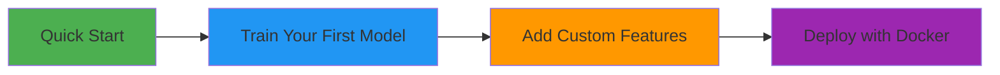

# 📚 Tutorials

Welcome to the tutorials section! These learning-oriented guides will help you get started with the AMES House Price Prediction system through hands-on examples.

## 🎯 What You'll Learn

Our tutorials are designed to take you from zero to productive, step by step. Each tutorial builds on fundamental concepts and provides a complete, working example.

## 📖 Available Tutorials

-   :material-rocket-launch:{ .lg .middle } __[Quick Start](quickstart.md)__

    ---

    **Time:** 5 minutes  
    **Level:** Beginner

    Make your first house price prediction using Docker. No setup required!

    [:octicons-arrow-right-24: Start here](quickstart.md)

-   :material-brain:{ .lg .middle } __[Train Your First Model](first-model.md)__

    ---

    **Time:** 20 minutes  
    **Level:** Beginner

    Learn the complete ML pipeline from data loading to model training and evaluation.

    [:octicons-arrow-right-24: Train a model](first-model.md)

-   :material-puzzle:{ .lg .middle } __[Add Custom Features](custom-features.md)__

    ---

    **Time:** 15 minutes  
    **Level:** Intermediate

    Extend the feature engineering pipeline with your own custom features.

    [:octicons-arrow-right-24: Create features](custom-features.md)

-   :material-docker:{ .lg .middle } __[Deploy with Docker](deploy-docker.md)__

    ---

    **Time:** 10 minutes  
    **Level:** Beginner

    Package and deploy your ML service as Docker containers for production.

    [:octicons-arrow-right-24: Deploy](deploy-docker.md)

## 🎓 Learning Path

We recommend following the tutorials in this order:

1. **[Quick Start](quickstart.md)** - Get immediate results and see what's possible
2. **[Train Your First Model](first-model.md)** - Understand the ML pipeline
3. **[Add Custom Features](custom-features.md)** - Learn to customize and extend
4. **[Deploy with Docker](deploy-docker.md)** - Take it to production

## 💡 Tutorial vs How-To Guide

!!! info "What's the difference?"
    
    **Tutorials** are learning-oriented. They guide you through a complete journey to build understanding, even if you take detours that wouldn't be necessary in production.
    
    **[How-To Guides](../how-to/)** are problem-oriented. They provide direct solutions to specific tasks you want to accomplish.
    
    If you're new, start with tutorials. If you know what you want to do, jump to how-to guides.

## 🎯 Prerequisites

Most tutorials assume you have:

- [x] Python 3.12+ installed
- [x] Basic command line familiarity
- [x] Basic Python knowledge (variables, functions, imports)
- [x] (Optional) Docker installed for deployment tutorials

Don't worry if you're not an expert! The tutorials are designed for learners and provide complete, working examples.

## 🆘 Getting Help

If you get stuck while following a tutorial:

1. **Check the troubleshooting section** at the end of each tutorial
2. **Review the [Troubleshooting Guide](../how-to/troubleshooting.md)** for common issues
3. **Read the [Explanation](../explanation/)** section to understand concepts better
4. **Open an issue** on [GitHub](https://github.com/nikolaos-mavromatis/ames_house_price_prediction/issues) if you find a bug

## 🚀 Ready to Start?

Pick a tutorial above or start with the [Quick Start](quickstart.md) to get your first prediction in 5 minutes!

---

!!! tip "Pro Tip"
    
    Each tutorial includes:
    
    - ✅ Complete, copy-paste-ready code
    - ✅ Expected output examples
    - ✅ Common pitfalls to avoid
    - ✅ Links to reference documentation
    
    Take your time and experiment along the way!
