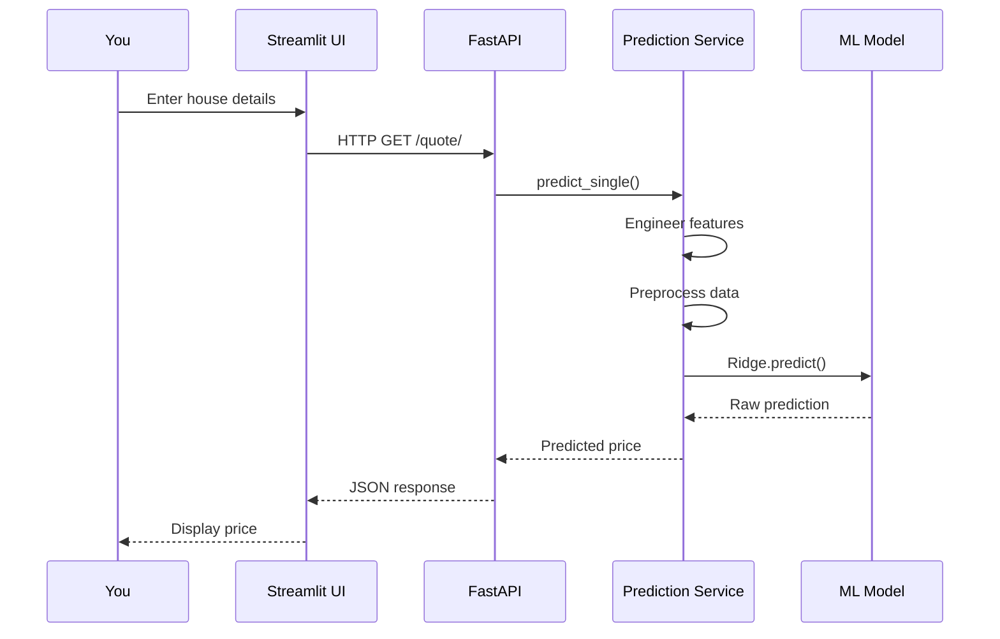

# 🚀 Quick Start

Get your first house price prediction in just 5 minutes using Docker!

## 🎯 What You'll Learn

In this tutorial, you'll:

- [x] Launch the entire application with one command
- [x] Make predictions using the web interface
- [x] Query the REST API
- [x] Understand the basic architecture

**Time required:** ~5 minutes  
**Prerequisites:** Docker and Docker Compose installed

## 📦 Step 1: Get the Code

Clone the repository:

```bash
git clone https://github.com/nikolaos-mavromatis/ames_house_price_prediction.git
cd ames_house_price_prediction
```

??? question "Don't have Git?"
    Download the ZIP file from GitHub:
    
    1. Visit the [repository](https://github.com/nikolaos-mavromatis/ames_house_price_prediction)
    2. Click the green "Code" button
    3. Select "Download ZIP"
    4. Extract and navigate to the folder

## 🐳 Step 2: Launch with Docker

Start all services with a single command:

```bash
docker-compose up --build
```

You'll see output like this:

```
[+] Building 2.3s (15/15) FINISHED
[+] Running 3/3
 ✔ Network housing-app    Created
 ✔ Container app          Created
 ✔ Container api          Created
Attaching to api, app
api  | INFO:     Uvicorn running on http://0.0.0.0:8000
app  | You can now view your Streamlit app in your browser.
app  | Local URL: http://localhost:8501
```

!!! success "Services Running"
    Once you see the messages above, all services are ready!

## 🌐 Step 3: Access the Services

Open these URLs in your browser:

| Service | URL | Purpose |
|---------|-----|---------|
| **Streamlit UI** | [http://localhost:8501](http://localhost:8501) | Interactive web interface |
| **FastAPI** | [http://localhost:8000](http://localhost:8000) | API health check |
| **API Docs** | [http://localhost:8000/docs](http://localhost:8000/docs) | Interactive API documentation |

## 🖥️ Step 4: Make a Prediction (Web UI)

1. **Open the Streamlit UI** at [http://localhost:8501](http://localhost:8501)

2. **Fill in the house characteristics:**

    ```
    Lot Area: 8450
    Year Built: 2003
    Year Remodeled: 2003
    Overall Quality: 7
    Overall Condition: 5
    ```

3. **Click "Quote me now!"**

4. **View your prediction:**

    

    You should see a predicted price around **$184,000**!

!!! tip "Try Different Values"
    Experiment with different inputs to see how they affect the prediction:
    
    - Higher quality → Higher price
    - Larger lot area → Higher price
    - Older house → Lower price (usually)

## 🔌 Step 5: Use the API

You can also get predictions programmatically using the REST API.

=== "Python"

    ```python
    import requests

    response = requests.get(
        "http://localhost:8000/quote/",
        params={
            "LotArea": 8450,
            "YearBuilt": 2003,
            "YearRemodAdd": 2003,
            "OverallQual": 7,
            "OverallCond": 5,
        }
    )

    result = response.json()
    print(f"Predicted price: ${result['predicted_price']:,.2f}")
    ```

    **Output:**
    ```
    Predicted price: $184,408.00
    ```

=== "cURL"

    ```bash
    curl -X GET "http://localhost:8000/quote/?LotArea=8450&YearBuilt=2003&YearRemodAdd=2003&OverallQual=7&OverallCond=5"
    ```

    **Output:**
    ```json
    {
      "predicted_price": 184408.00,
      "input_features": {
        "LotArea": 8450,
        "YearBuilt": 2003,
        "YearRemodAdd": 2003,
        "OverallQual": 7,
        "OverallCond": 5
      }
    }
    ```

=== "JavaScript"

    ```javascript
    fetch('http://localhost:8000/quote/?LotArea=8450&YearBuilt=2003&YearRemodAdd=2003&OverallQual=7&OverallCond=5')
      .then(response => response.json())
      .then(data => console.log(`Predicted price: $${data.predicted_price.toFixed(2)}`));
    ```

## 📊 Step 6: Explore the API Docs

Visit [http://localhost:8000/docs](http://localhost:8000/docs) to see the interactive Swagger UI:

1. **Try the GET /quote/ endpoint**
2. **Click "Try it out"**
3. **Fill in parameters**
4. **Click "Execute"**
5. **See the response**

The interactive docs let you test all endpoints directly from your browser!

## 🏗️ Understanding What Just Happened

When you made a prediction, here's what occurred:



The system:

1. **Receives** your input through Streamlit or direct API call
2. **Engineers** new features (LotAge, YearsSinceRemod)
3. **Preprocesses** data (handles missing values, scales features, creates polynomial features)
4. **Predicts** using the Ridge regression model
5. **Returns** the predicted price

[Learn more about the architecture →](../explanation/architecture.md)

## 🛑 Step 7: Stop the Services

When you're done, stop the Docker containers:

```bash
# Press Ctrl+C in the terminal where docker-compose is running
# OR run this in a new terminal:
docker-compose down
```

## ✅ What You've Accomplished

Congratulations! You've successfully:

- [x] Launched a complete ML application with Docker
- [x] Made predictions using the web interface
- [x] Queried the REST API
- [x] Explored the interactive API documentation
- [x] Understood the basic prediction flow

## 🚀 Next Steps

Now that you've made your first prediction, you can:

<div class="grid cards" markdown>

-   :material-brain:{ .lg .middle } __Train Your Own Model__

    ---

    Learn how the ML pipeline works and train a model from scratch

    [:octicons-arrow-right-24: Train a model](first-model.md)

-   :material-api:{ .lg .middle } __Integrate the API__

    ---

    Build applications that use the prediction API

    [:octicons-arrow-right-24: API Integration](../how-to/api-integration.md)

-   :material-puzzle:{ .lg .middle } __Add Custom Features__

    ---

    Extend the model with your own feature engineering

    [:octicons-arrow-right-24: Custom features](custom-features.md)

-   :material-book-open-variant:{ .lg .middle } __Explore the API__

    ---

    See all available endpoints and parameters

    [:octicons-arrow-right-24: API Reference](../reference/api-endpoints.md)

</div>

## 🆘 Troubleshooting

??? failure "Port Already in Use"
    **Error:** `Bind for 0.0.0.0:8000 failed: port is already allocated`
    
    **Solution:** Another service is using ports 8000 or 8501. Either:
    
    - Stop the other service
    - Edit `docker-compose.yml` to use different ports:
      ```yaml
      ports:
        - "8001:8000"  # Use 8001 instead of 8000
      ```

??? failure "Docker Not Running"
    **Error:** `Cannot connect to the Docker daemon`
    
    **Solution:**
    
    - Make sure Docker Desktop is running
    - On Linux, start the Docker service: `sudo systemctl start docker`

??? failure "Out of Memory"
    **Error:** Docker crashes or becomes unresponsive
    
    **Solution:** Increase Docker's memory allocation:
    
    - Docker Desktop → Settings → Resources → Memory
    - Allocate at least 4GB

??? question "Different Prediction Values?"
    If you get slightly different predictions, that's normal! Small variations can occur due to:
    
    - Different model versions
    - Floating-point precision
    - Feature scaling variations
    
    The predictions should be within 1-2% of each other.

---

!!! success "You Did It! 🎉"
    You've completed the Quick Start tutorial! You now have a working ML prediction system.
    
    Ready to dive deeper? Try the [Train Your First Model](first-model.md) tutorial next!
